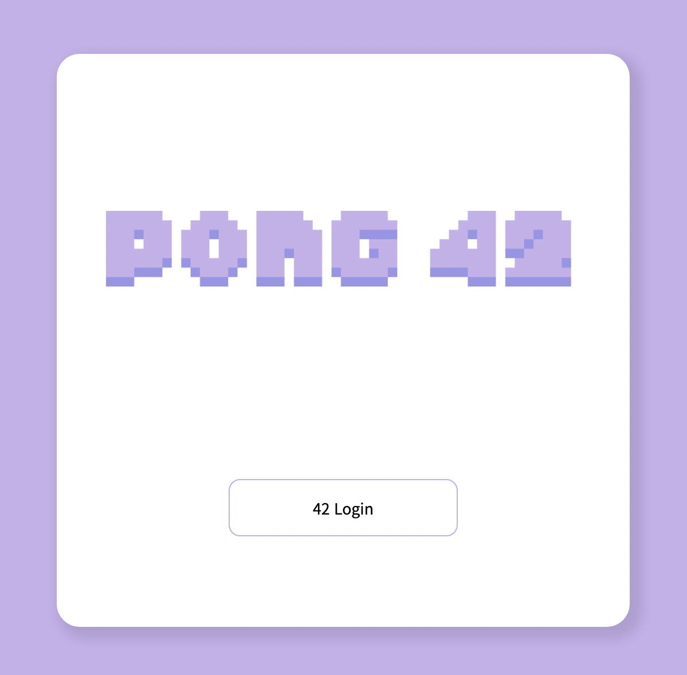

<a id="readme-top"></a>

<!-- PROJECT LOGO -->
<br />
<div align="center">
  <a href="https://github.com/42-Tomodachi/ft_transcendence">
    
  </a>

  <h3 align="center">Multiplayer Pong & Chat Web Site</h3>

  <p align="center">
    A final Project in 42
    <br />
    <br />
    
    
    
    <br />
    
    
    
    <br />
    
    

  </p>
</div>
<br />

<!-- TABLE OF CONTENTS -->
<details>
  <summary>Table of Contents</summary>
  <ol>
    <li>
      <a href="#about-the-project">About The Project</a>
      <ul>
        <li><a href="#signup">Signup</a></li>
        <li><a href="#lobby">Lobby</a></li>
        <li><a href="#in-chat">In Chat</a></li>
        <li><a href="#in-game">In Game</a></li>
      </ul>
    </li>
    <li>
      <a href="#getting-started">Getting Started</a>
      <ul>
        <li><a href="#prerequisites">Prerequisites</a></li>
        <li><a href="#installation">Installation</a></li>
      </ul>
    </li>
    <li><a href="#constraint">Constraint</a>
        <ul>
            <li><a href="#frontend">Frontend</a></li>
            <li><a href="#backend">Backend</a></li>
        </ul>
    </li>
    <li><a href="#member">Member</a></li>
    <li><a href="#license">License</a></li>
  </ol>
</details>

<!-- ABOUT THE PROJECT -->
<br />

## About The Project

---

<!-- 간단한 프로젝트 설명 -->
<!-- 구현 및 기술 스택 선정 이유 -->
<div align="center">
  
</div>

pong 42는 Typescript 기반의 React, Nest를 사용해서 만든 채팅 / 핑퐁 사이트이다.

페이지 구성으로는 회원가입, 메인 로비, 채팅방(일반, DM), 게임방이며 유저의 현재 상태, 채팅, 게임등 특정 요소를 실시간으로 반영했다.

<br/>

### Signup

#### 최초 회원가입 단계

<a href="https://youtu.be/YkjRyQb0Kxc">
  
</a>

> - 최초 회원가입시 42API를 통해 42cadet인지 확인
> - 프로필 작성에서 닉네임만 필수 입력으로 받음. 따로 프로필 등록을 하지 않으면 기본 프로필이 등록
> - 회원 등록이 완료시 기존 전체 유저목록을 보는 모든 유저들의 목록이 새로운 유저가 추가됨.

#### (2차인증 활성화시) 2차인증

<a href="https://youtu.be/5YgCceofzrs">
    
</a>

> - 42 intra에 등록된 이메일이 아니어도 2차 인증 정보를 받을 이메일이면 무관
> - 매번 로그인할 때마다 인증코드를 기입해야하며 로비에 있는 `내 프로필`의 2차 인증 비활성화를 눌러서 해제할 수 있음

### Lobby

#### 게임 / 채팅 로비

<a href="https://youtu.be/Enz_ptGrn5I">
    
</a>

> - 기본 로비는 게임방 목록이 보이는 게임 로비로 `42 PONG`로고를 입력하면 기본 로비로 이동한다
> - 게임 / 채팅 로비 둘다 디자인 골격은 동일(방 목록, 유저 목록, 내 프로필)하나 게임은 `래더 게임 입장`, 채팅은 `참여중인 채팅방`라는 고유 기능이 존재

#### 내 프로필 변경

<a href="https://youtu.be/OfwC8gAAh_A">
    
</a>

> - 게임 페이지빼고는 모든 페이지에서 로그인한 유저의 프로필 변경이 가능
> - `내 프로필 수정` 창에서 확인 버튼을 누르지 않는 이상 닉네임, 프로필 사진이 갱신되진 않는다.
> - 또한, 둘 중 하나라도 변경 사항이 있으면 프로필 갱신이 된다.

#### 유저 상태 실시간 반영(로그인, 로그아웃, 게임중)

<a href="https://youtu.be/7B3Tcogg0bQ">
    
</a>

> - 친구 관계는 팔로잉(Following) 관계로 한쪽에서 친구 추가시 해당 유저의 친구목록에만 해당 유저가 확인된다.
> - 유저가 로그인, 로그아웃, 게임중의 상태를 유저 목록에서 실시간으로 확인 가능

#### 게임 초대하기 / 초대받기 / 거절하기

<a href="https://youtu.be/koJMfGcMJJw">
    
</a>

> - 게임 초대는 어느 페이지든 유저 목록에서 특정 유저의 프로필 창을 볼 수 있다면 대전 신청이 가능하다. (단, 로그인 상태인 유저에게만 가능)
> - 승인과 동시에 게임 카운트가 시작된다.

### In Chat

#### 기본 채팅 기능

<a href="https://youtu.be/wqPQWakBmZ8">
    
</a>

> - 채팅방 입장, 퇴장, 강퇴 등 전체 유저가 알아야할 내용은 브로드캐스팅 방식으로 채팅창 안에 공지 메세지로 표기

#### 채팅방 내 권한에 따른 기능

<a href="https://youtu.be/OUAKufhUSrs">
    
</a>

> - 채팅방 내 권한은 방 주인, 관리자, 일반으로 나뉘며 각 권한에 따라 유저 프로필을 볼 때 보여지는 프로필 구성이 다르다.
> - 방 관리자라 해도 방 주인을 강퇴, 음소거할 수는 없다.
> - 강퇴, 음소거시 10초간 해당 유저는 재입장, 채팅 입력이 금지된다.

#### 방 설정 변경

<a href="https://youtu.be/64Nd8Vj19ns">
    
</a>

> - 방 설정은 오직 방 주인만 변경이 가능하다.
> - 방 비밀번호를 입력하면 자동으로 비공개방으로 변경된다.
> - 공개방일 때 입장한 유저는 비공개방으로 변경되어도 `방 나가기`를 하지 않는 이상 입장할 때 비밀번호를 입력할 필요가 없다.

#### DM 보내기

<a href="https://youtu.be/DcYEWvthf0s">
    
</a>

> - 채팅방 안에서만이 아니라 유저 프로필을 볼 수 있는 어디서든 특정 유저에게 DM을 보낼 수 있다.

### In Game

#### 일반 게임

<a href="https://youtu.be/XwMGma5fhzk">
  
</a>

> - test

#### 게임 모드 설정(장애물)

<a href="https://youtu.be/bDv107LVAmU">
  
</a>

> - test

#### 래더 매칭

<a href="https://youtu.be/7idwiwtCIhw">
  
</a>

> - test

<p align="right"><a href="#readme-top">back to top</a></p>

## Getting Started

### Prerequisites

1. **본 프로젝트는 42 intra를 이용할 수 있는 42cadet이어야 정상 이용이 가능하다.**

2. 42API로 발급받은 UID, secret key, redirection URL을 사용해 각 컨테이너별 .env에 해당 값들을 작성해줘야 한다.

3. docker, docker-compose가 설치된 환경이어야 한다.

### Installation

1. git clone this projest

```sh
  git clone https://github.com/42-Tomodachi/ft_transcendence
```

2. run docker compose at root

```sh
  cd ft_transcendence && docker-compose up --build
```

<p align="right"><a href="#readme-top">back to top</a></p>

## Constraint

> 최초 목표로 잡은 기간(about 45days)안에 완성하기 위해 놓치거나 간과한 설계, 기능들

### Frontend

#### 공통

```text
    1. 최적화를 고려하지않고 구현했기에 불필요한 리렌더링이 많이 발생한다.
    2. Next.js가 아닌 CRA를 사용
    3. 재사용 가능한 부분이 많지만 고유 컴포넌트로 제작
    4.
```

#### 채팅

```text
    1.
    2.
```

#### 게임

```text
    1.
    2.
```

### Backend

#### 공통

```text
    1.
    2.
```

#### 채팅

```text
    1.
    2.
```

#### 게임

```text
    1.
    2.
```

<p align="right"><a href="#readme-top">back to top</a></p>

<!-- Prject member -->

## Member

### Frontend

| [dhyeon]() | [junselee]() | [mosong](https://www.github.com/mike2ox)                               | [sgang]() |
| ---------- | ------------ | ---------------------------------------------------------------------- | --------- |
|            |              |  |           |

<br />

### Backend

| [jihokim]() | [kankim]() | [seungyel]() |
| ----------- | ---------- | ------------ |
|             |            |              |

<p align="right"><a href="#readme-top">back to top</a></p>

## Resource & Reference

### Resource

- [Figma](https://www.figma.com/file/UjJCRaBS3Kc9o7jiX00Q7g/%ED%8A%B8%EC%84%BC?node-id=0%3A1)
- [ERDCloud](https://www.erdcloud.com/d/JZBPBnQaPY6zGt4Rr)

### Convention

- [Frontend Code Convention](./.github/FE_CODE_CONVENTION.md)
- [Backend Code Convention](./.github/BE_CODE_CONVENTION.md)
- [Git Convention](./.github/GIT_CONVENTION.md)

<br/>
<!-- LICENSE -->

## License

해당 프로젝트는 [MIT 라이센스](https://github.com/42-Tomodachi/ft_transcendence/blob/main/LICENSE)를 기반으로 두고 있습니다.

<p align="right"><a href="#readme-top">back to top</a></p>
